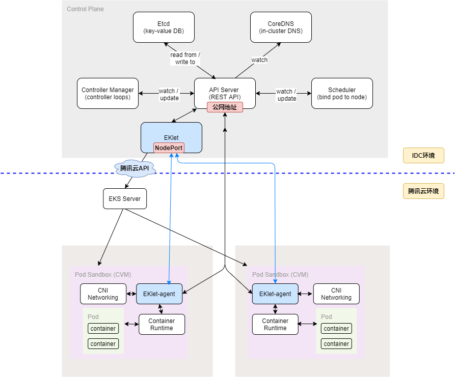
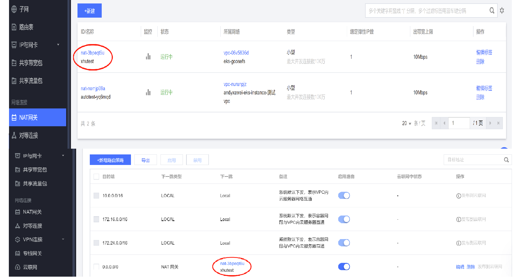

### Play TKE Resilience Chart without dedicated network between IDC and Tencent Cloud 


## 目的

通过消除IDC和腾讯云的专线依赖，让用户快速体验IDC workload 弹性到腾讯云[tke-resilience chart](https://github.com/tkestack/charts/tree/main/incubator/tke-resilience/release-v0.5.0/tke-resilience)的特性，


## 限制

当IDC和腾讯云在没有专线的情况下，IDC的 workload 和腾讯云上的workload的pod和service将无法联通


## 方案

1. 在IDC侧，将IDC的K8S apisever和IDC的eklet暴露在公网上(防火墙需要放通apisever的端口和eklet nodePort的端口)，使腾讯云侧VM中的eklet-agent可以连接报告心跳和支持`kubectl logs/exec`
2. 在腾讯云测，为VPC配置NAT网关，使腾讯云侧VM中的eklet-agent可以连接到用户IDC的apiserver


## 架构图



## 验证环境

 K8S 1.15.7 + CNI v0.8.2  + Calico v3.8.9

```
root@VM-191-92-ubuntu:~# kubectl get node
NAME               STATUS   ROLES    AGE   VERSION
vm-191-92-ubuntu   Ready    master   93d   v1.15.7
root@VM-191-92-ubuntu:~# kubectl exec -it  calico-node-nwdc5 -n kube-system -- /bin/bash -c "calico-node -v"
v3.8.9
root@VM-191-92-ubuntu:~# kubectl get po -A
NAMESPACE     NAME                                       READY   STATUS    RESTARTS   AGE
kube-system   calico-kube-controllers-7fc57b95d4-pz9rn   1/1     Running   1          93d
kube-system   calico-node-nwdc5                          1/1     Running   1          93d
kube-system   coredns-5d4dd4b4db-jjbjz                   1/1     Running   1          93d
kube-system   coredns-5d4dd4b4db-p5jmg                   1/1     Running   1          93d
kube-system   etcd-vm-191-92-ubuntu                      1/1     Running   1          93d
kube-system   kube-apiserver-vm-191-92-ubuntu            1/1     Running   1          93d
kube-system   kube-controller-manager-vm-191-92-ubuntu   1/1     Running   1          93d
kube-system   kube-proxy-pth55                           1/1     Running   1          93d
kube-system   kube-scheduler-vm-191-92-ubuntu            1/1     Running   1          93d
root@VM-191-92-ubuntu:~# 
```

## 步骤

1. 保证 `验证环境`的K8S可用， apiserver 公网IP和端口防火墙已放通

2. clone 代码 
```
 git clone https://github.com/tkestack/charts.git
Cloning into 'charts'...
remote: Enumerating objects: 4193, done.
remote: Counting objects: 100% (4193/4193), done.
remote: Compressing objects: 100% (2471/2471), done.
remote: Total 4193 (delta 1854), reused 3923 (delta 1603), pack-reused 0
Receiving objects: 100% (4193/4193), 5.42 MiB | 20.94 MiB/s, done.
Resolving deltas: 100% (1854/1854), done.
root@VM-121-42-ubuntu:/tmp# 
```
3. 根据自己的情况修改 `tke-resilience/values.yaml`, 确保`podUsedApiserver`公网可访问
4. 安装chart,  注意指定最新image

```
helm install tke-resilience --namespace kube-system ./tke-resilience --set image.repository=eklet.image.ref=ccr.ccs.tencentyun.com/tkeimages/eklet-amd64:v2.6.27  --debug 
```
5. check status

```
root@VM-191-92-ubuntu:~# kubectl get po -A
NAMESPACE     NAME                                            READY   STATUS    RESTARTS   AGE
kube-system   calico-kube-controllers-7fc57b95d4-pz9rn        1/1     Running   1          93d
kube-system   calico-node-nwdc5                               1/1     Running   1          93d
kube-system   coredns-5d4dd4b4db-jjbjz                        1/1     Running   1          93d
kube-system   coredns-5d4dd4b4db-p5jmg                        1/1     Running   1          93d
kube-system   eklet-tke-resilience-75f6b7fc6f-jjfpd           1/1     Running   0          2s
kube-system   eks-admission-tke-resilience-545899b686-xxnzj   1/1     Running   0          2s
kube-system   etcd-vm-191-92-ubuntu                           1/1     Running   1          93d
kube-system   kube-apiserver-vm-191-92-ubuntu                 1/1     Running   1          93d
kube-system   kube-controller-manager-vm-191-92-ubuntu        1/1     Running   1          93d
kube-system   kube-proxy-pth55                                1/1     Running   1          93d
kube-system   kube-scheduler-vm-191-92-ubuntu                 1/1     Running   1          93d
kube-system   scheduler-tke-resilience-79dbb4fd5f-sprnb       1/1     Running   0          2s
```

6. 查看nodePort为 `31480`, 确保集群中至少有一个节点 nodeIP:nodePort公网能访问(放通idc侧防火墙放通)

```
root@VM-191-92-ubuntu:~# kubectl get svc -n kube-system |grep eklet
eks-eklet   NodePort    10.45.104.17   <none>        10241:31480/TCP          69s
root@VM-191-92-ubuntu:~# 
```

7. 配置 腾讯云侧VPC NAT网关, 假定vpv是 `vpc-06v5836d`



8. 验证， 本地一个副本，云上3个， **注意给deployment的template.metadata.annotations:加上 `internal.eks.tke.cloud.tencent.com/eklet-address: ${node-ip}:{nodePort}`**

```
root@VM-191-92-ubuntu:~# cat busybox2.yaml 
apiVersion: apps/v1
kind: Deployment
metadata:
  name: busybox-deployment
  labels:
    app: busybox
spec:
  replicas: 4
  strategy: 
    type: RollingUpdate
  selector:
    matchLabels:
      app: busybox
  template:
    metadata:
      annotations:
        AUTO_SCALE_EKS: "true"
        LOCAL_REPLICAS: "1"
      labels:
        app: busybox
    spec:
      #社区版K8S集群需要指定调度器
      schedulerName: tke-scheduler
      containers:
      - name: busybox
        image: busybox
        imagePullPolicy: IfNotPresent
        command: ['sh', '-c', 'echo Container 1 is Running ; sleep 3600']
root@VM-191-92-ubuntu:~# 
kubectl  create -f busybox2.yaml 

root@VM-191-92-ubuntu:~# kubectl  get po -o wide
NAME                                  READY   STATUS    RESTARTS   AGE   IP             NODE                    NOMINATED NODE   READINESS GATES
busybox-deployment-5475598f94-77hzl   1/1     Running   0          46s   10.44.4.120    vm-191-92-ubuntu        <none>           <none>
busybox-deployment-5475598f94-nddrr   1/1     Running   0          46s   10.0.191.48    eklet-subnet-m8etvnmu   <none>           <none>
busybox-deployment-5475598f94-t8d8f   1/1     Running   0          46s   10.0.191.242   eklet-subnet-m8etvnmu   <none>           <none>
busybox-deployment-5475598f94-wkpv4   1/1     Running   0          46s   10.0.191.211   eklet-subnet-m8etvnmu   <none>           <none>
root@VM-191-92-ubuntu:~# 
```


